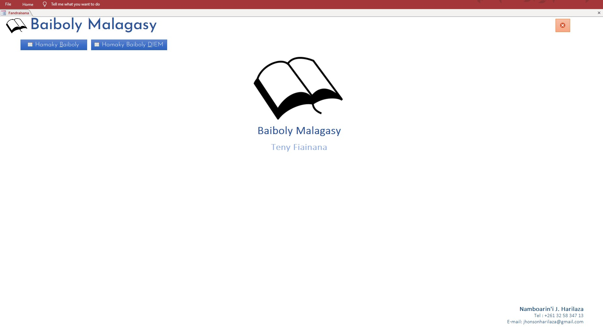

# Malagasy Bible in MS Access

  

It's a simple Malagasy bible database in MS Access with a simple UI for search.
----
There is two versions :
* DIEM version
* Protestant version

These data was taken from 
* DIEM : [RaveloMevaSoavina/baiboly-json](https://github.com/RaveloMevaSoavina/baiboly-json) ,
* Protestant : [Malagasy.xml]

Enjoy, Pray and Read :) 
----
Soli Deo Gloria
